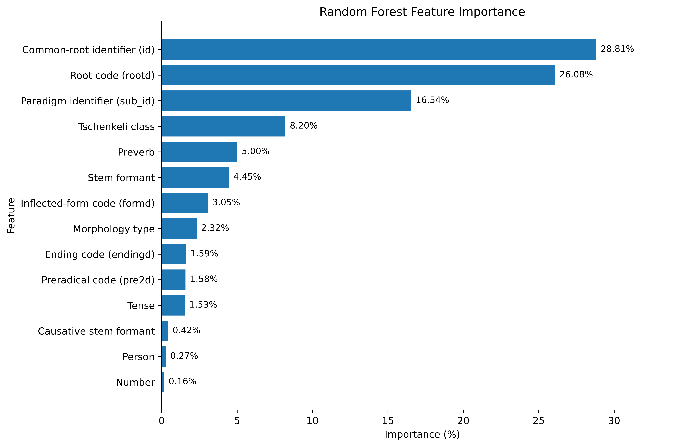

# KartuVerbs

**KartuVerbs** is a Linked Data and machine-learning resource for the
Georgian verbal system.

The project provides:

- a structured dataset of Georgian verb forms;
- mappings between inflected forms and verbal nouns (masdars);
- machine-learning models for predicting missing verbal nouns;
- RDF representations of the lexical data;
- SPARQL/Fuseki configuration files;
- evaluation results and visualizations.

The current machine-learning experiments use Random Forest models to
predict missing verbal nouns and evaluate model generalization using
standard train/test splits, K-Fold cross-validation, and Group K-Fold
validation.

## Repository structure

```text
KartuVerbs/
├── KartuVerbs.ipynb
├── KartuVerbs_2.1_RF.ipynb
├── KartuVerbs_2.2_RF.ipynb
│
├── data/        # Input datasets
├── scripts/     # Data processing and RDF conversion scripts
├── RDF/         # RDF templates and Apache Jena Fuseki configuration
├── figures/     # Generated figures
├── results/     # Evaluation results and predictions
├── models/      # Model metadata
│
├── README.md
└── LICENSE


## Feature importance



## Classification results


tsch_class, morph_type, id and sub_id.

# Source code
The source code is publicly available under the GPL v2 license
https://github.com/aelizbarashvili/KartuVerbs
